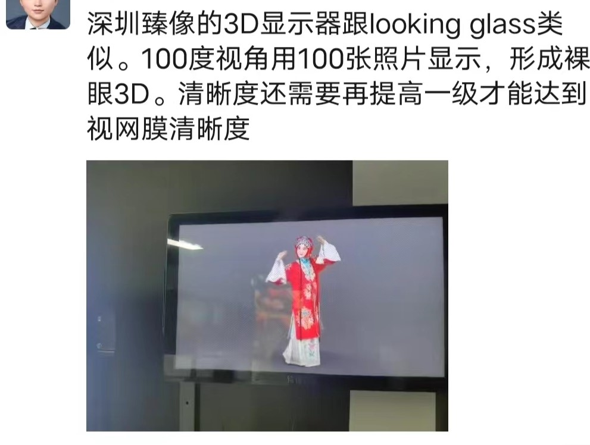
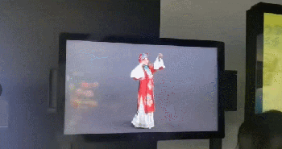

# Dual-Screen-Stereoscopic

双屏动态裸眼立体效果展示器。只是记录想法，有缘、有时间、有兴致的时候再建设，有友人想一同可留 issue。

------

## 背景

立体画 是在一张纸上 画出 物体 在某个特定角度去看 就有 “跃然纸上” 的裸眼立体效果，[图片搜索](https://image.baidu.com/search/index?tn=baiduimage&ct=201326592&lm=-1&cl=2&ie=gb18030&word=%C1%A2%CC%E5%BB%AD&fr=ala&ala=1&alatpl=normal&pos=0&dyTabStr=MCwzLDIsMSw1LDgsNCw2LDcsOQ%3D%3D)、和 [b 站一搜](https://search.bilibili.com/all?keyword=%E7%AB%8B%E4%BD%93%E7%94%BB&from_source=webtop_search&spm_id_from=333.1007&search_source=5) 有很多，多年前火过，也有在两张垂直的纸上画的立体效果更佳。

要做裸眼立体效果，真正的全息投影 像 钢铁侠电影里面那种 目前科技是达不到，像 VR、AR 这些正在慢慢成熟（嵌入式设备的算力和能耗限制），还有一些巧妙的别出心裁的方案比如 [旋转灯条](https://www.bilibili.com/video/BV1Vs411c78K/)、[重叠屏幕](https://www.bilibili.com/video/BV1Dq4y1h7kc/)（光立方？），[伪全息投影金字塔](https://www.bilibili.com/video/BV1Q44y187Ss/) 等等（这里面给出的链接只是 打样、举例，实际 相关的自制的东西 和产品 很多很多，因为门槛不高）。

但是要说 那得上台面的 效果最好的 现实中展现裸眼立体效果，又回到了 上面的 “立体画”，最近也有一阵传的很热 各国都有的 街头 街角处 两块动态显示的屏幕 形成强烈立体效果的展示，就是立体屏幕，举例：

- [这公司把海浪装在大楼里，太汹涌快冲破玻璃了，你猜怎么做到的_哔哩哔哩_bilibili](https://www.bilibili.com/video/BV18K411W7Zu/)。
- [《原神》芭芭拉裸眼3D广告——成都太古里_哔哩哔哩bilibili_原神](https://www.bilibili.com/video/BV1Sr4y127M8/)。
- [立体屏幕裸眼3D第一弹_哔哩哔哩_bilibili](https://www.bilibili.com/video/BV1NF411n7Z4/)。
- [震撼炫酷的沉浸式发布会裸眼3D全息视效设计_哔哩哔哩_bilibili](https://www.bilibili.com/video/BV1XY4y1z7ce/)。
- [裸眼3D，让飞行器触手可及 - 知乎 (zhihu.com)](https://zhuanlan.zhihu.com/p/582018713)。

简单说明原理，就是先选择一个观看的特定角度，用电脑合成方式 虚拟的放入 要立体展示的物体，然后将这个物体在 观察的视线的方向上 向 显示的平面（屏幕） “拍扁”，拍到 显示平面上的 图形就是要显示的画面，即投影。这个视频演示这个 制作的过程，用 PS 来做一张 立体画：[【立体画另类教程】用PS还原街头立体画原图_哔哩哔哩_bilibili](https://www.bilibili.com/video/BV1ex411S7uB/)，这里是两张垂直纸上显示的，其余显示均同理。

## 想法

想法最初产生于 2016 年 大一下，灵感来源于立体画，立体画的裸眼立体效果还不错，当时想能动起来就更棒了（后来有了上面的 街头立体屏幕...[我高中、大一时候有很多想法、点子，大多都发现要么当时已经有了，要么后来有了 哈哈](https://www.zhihu.com/question/31937124/answer/969731059)，相关知乎 [有哪些你小时候的想法现在已经实现了的？ - 知乎 (zhihu.com)](https://www.zhihu.com/question/38090663)、[你小时候有哪些幻想现在已经成为了现实？ - 知乎 (zhihu.com)](https://www.zhihu.com/question/57214115)、[你曾经有过什么奇思妙想（如发明、创造或者想法），最终发现别人实现了？ - 知乎 (zhihu.com)](https://www.zhihu.com/question/64629467)）。

然后后来想 光在一个特定地方 看 才有 立体效果，nonono，不能够！再加个跟踪，随人眼位置变化 而显示内容也跟着变化，实时都有立体感觉，那不 更加觉得 那地方就有一个真是的存在了吗。

诚然，这个人眼跟踪有个难点 那就是观察者 眼睛位置 的 空间定位！而且显示原理限制也只能够一个特定方向去看才有立体效果。

具体的，可先做桌面级别的，找 两个屏幕 摆成 L 形，实时定位观察者角度 并 投影计算，显示出来。

先可以简单的立体图形比如 立方体，简单的立体物可能效果更明显，并可跟随观测视角，实时计算投影并更新显示（无卡顿）。可小的笔记本电脑大小，可大的一人高。

相关最接近这个的是一个演示技术，暂时没搜到，我体验过一次，也忘了在哪个场馆体验过。。是一个小屋子，里面六个面 全是屏幕，人走进去，就显示 一个 虚拟的场景，并且是实时随人移动而变化的，不过 “身临其境” 感 不稳定，画面分辨率不高、画面抖动（跟踪不稳）、透视错误（没跟踪对） 等等 可能的原因 导致 立体感 有那么 几秒钟 然后 瞬间出戏。

------

最近看到类似的玩意：

